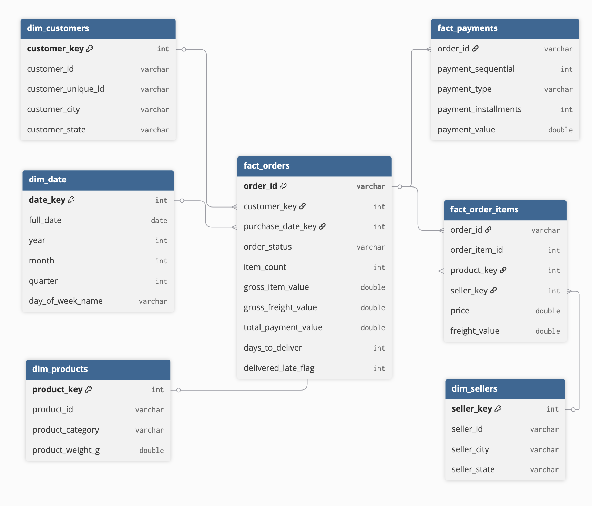

# Building a SQL Analytics Warehouse for E-commerce Data

This project builds a SQL-based analytics warehouse from raw e-commerce data using the Olist marketplace dataset. The goal is to transform transactional data into a structured model that supports business reporting and analysis.

Rather than running isolated queries, this project focuses on designing a clean data model and generating insights through reusable SQL.

---

## Overview

E-commerce data is often stored across multiple operational tables, making it difficult to analyze directly. This project organizes raw data into a structured analytics layer using staging, dimension, and fact tables.

The final model supports analysis of:
- revenue trends  
- customer behavior  
- product performance  
- seller performance  
- delivery and fulfillment metrics  

---

## Dataset

- Source:   
- ~100,000 orders from 2016–2018  
- Multiple relational tables including:
  - orders  
  - order items  
  - payments  
  - customers  
  - products  
  - sellers  

---

## Data Model



*Star-schema style analytics model. Fact tables capture orders, items, and payments, while dimension tables enable analysis by customer, product, seller, and time.*

### Fact Tables
- `fact_orders` → one row per order  
- `fact_order_items` → one row per item  
- `fact_payments` → one row per payment record  

### Dimension Tables
- `dim_customers`
- `dim_products`
- `dim_sellers`
- `dim_date`

---

## Build Process

### 1. Raw Data Ingestion
CSV files were loaded into DuckDB using `read_csv_auto()`.

### 2. Staging Layer
Data was cleaned and standardized:
- timestamp parsing  
- type casting  
- column normalization  
- joins for category translation  

### 3. Dimensional Modeling
Dimension tables were created to provide context for analysis.

### 4. Fact Tables
Fact tables were built at appropriate grain:
- orders  
- order items  
- payments  

Derived metrics include:
- delivery time  
- late delivery flag  
- total order value  
- item counts  

---

## Key SQL Concepts Used

- joins across multiple tables  
- common table expressions (CTEs)  
- window functions (`RANK`, `LAG`)  
- aggregations and grouping  
- date functions  
- data validation checks  

---

## Key Insights

- Revenue shows consistent monthly growth with seasonal variation  
- A small number of product categories drive the majority of sales  
- Delivery times vary significantly by region  
- Late deliveries occur in a measurable percentage of orders  
- Repeat customers represent a meaningful portion of total users  
- Seller performance is highly skewed, with top sellers driving most GMV  

---

## Example Query

### Monthly Revenue

```sql
SELECT
    DATE_TRUNC('month', order_purchase_ts) AS month,
    SUM(total_payment_value) AS revenue
FROM fact_orders
GROUP BY 1
ORDER BY 1;
